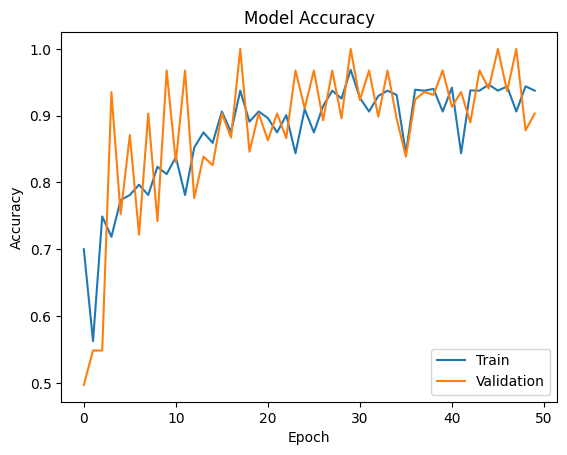
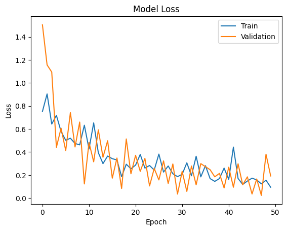
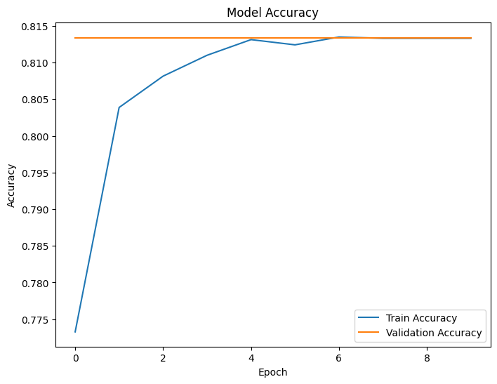
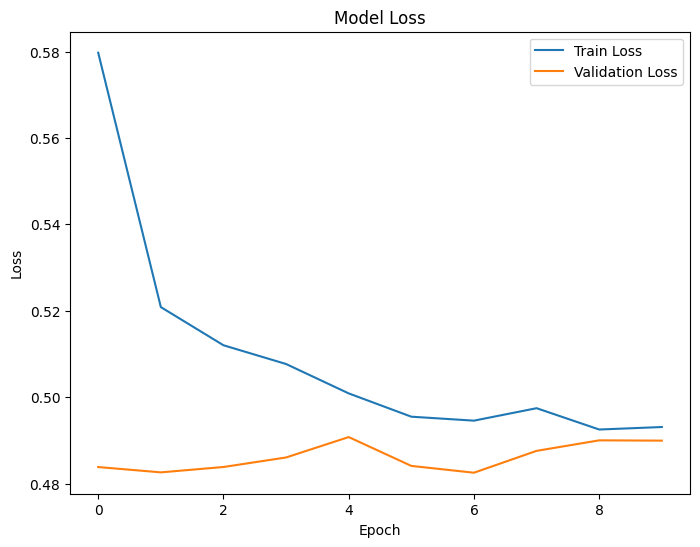

# Brain Tumor Classification

This repository contains a project for classifying brain tumors using Convolutional Neural Networks (CNNs). The project utilizes two different models: a custom CNN and a pre-trained ResNet50 model. The custom CNN is designed from scratch, while the ResNet50 model is used for transfer learning.

## Project Structure

- `Dataset/`: Contains the training and testing datasets.
- `main.py`: The main script to run the Streamlit application for predictions.
- `brain_tumor.h5`: The saved custom CNN model.
- `brain_tumor_resnet50.h5`: The saved ResNet50 model.
- `notebook.ipynb`: Jupyter notebook containing the code for training and evaluating the models.
- `README.md`: This readme file.

## Models

### Custom CNN

The custom CNN is built from scratch and consists of multiple convolutional layers followed by max-pooling layers, a flattening layer, and dense layers. The model is trained on the dataset and achieves a good accuracy.

### ResNet50

The ResNet50 model is a pre-trained model used for transfer learning. The top layers are replaced with custom layers suitable for our classification task. The model is fine-tuned on the dataset and achieves a high accuracy.

## Results

### Custom CNN

- **Accuracy**: 87.65%
- **Loss**: 0.3967




### ResNet50

- **Accuracy**: 93.42%
- **Loss**: 0.2345




### Conclusion

The ResNet50 model outperforms the custom CNN in terms of both accuracy and loss. It is more efficient and provides better results for the brain tumor classification task.

## Usage

To use the model for predictions, run the `main.py` script using Streamlit:

```bash
streamlit run main.py
```

This will start a web application where you can upload images and get predictions for brain tumor classification.

## License

This project is licensed under the MIT License.


Make sure to place the accuracy and loss chart images in an `images` directory within your repository for the image links to work correctly.
